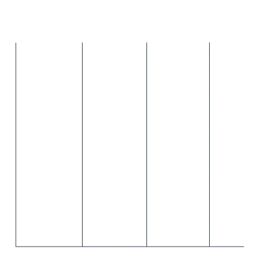
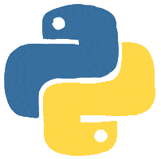

<!-- INTRODUCTION -->
<h1 align="center"><b>Hi </b>, I'm <a href="https://www.lvh-tony.com/" target="blank">
Hung Le (Tony)</a> </h1>
<h3 align="center">from Vietnam 🇻🇳 based in Canada 🇨🇦</h3>

<!-- typing gif -->

    

<!-- NEURAL NET GIF START >

    
    
    

<!-- NEURAL NET GIF END-->

<!-- WEBSITE LAST COMMIT >

  </a>

<!-- Neural Link -->

<!-- ABOUT ME - START -->

- 📫 How to reach me:
    - [**tony@contango.digital**](mailto:tony@contango.digital)
    - Telegram: @LVHTony
    - Discord: _tonyle
> “Here we stand and here shall we die, unbroken and unbowed. Though the very hand of death itself come for us, we will spit our defiance to the end!”
> 
> *— Chaplain-Dreadnought Armand Titus during the last stand on Khymara Ellipsis, embodying the indomitable spirit of the Astartes.*

<!-- ABOUT ME - END -->

<!-- QUOTE -->
<!--p>  

""
<!-- SKILLS
<h1 align="center">  Skills & Technologies:</h1>
<h3 align="center">👨‍💻 Data Science:</h3>

    <a>
        
        
        
        
        
        
        
        
        
        
        
        
        
        
    </a>

<h3 align="center">📊 Data Visualization:</h3>

  

<h3 align="center">🛠️ Tools:</h3>

    
    
    
    
    
    
    
    
    
    
    
    
    
    
    
    
    
  </a>

 -->
<!--/br>
<h1 align="center">  Get in touch with me:</h1>

  
  
  
    
  
  

<!-- Divider -->
<!-- 

    

 -->

<!-- Contribution Snake Grid -->

<!--h2 align = "center">Oh No! The  is eating my contribution!</h2>

    
    

 
-->

  

